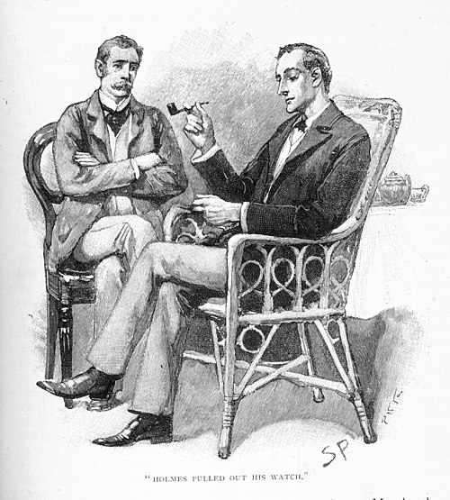
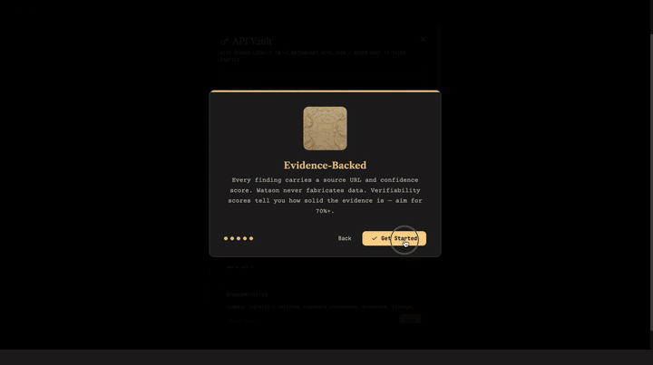

# 🕵️ Watson — The Agentic OSINT Investigation Engine

<p align="center">
  
</p>

<p align="center">
  <strong>Open source intelligence for an age of noise.</strong><br>
  <em>"When you have eliminated the impossible, whatever remains, however improbable, must be the truth."</em>
</p>

<p align="center">
  <a href="https://pypi.org/project/osintengine/"></a>
  <a href="https://www.python.org/downloads/"></a>
  <a href="LICENSE"></a>
  <a href="https://github.com/Lorenzobaron99/watson-osint"></a>
  <a href="https://lorenzobaron99.github.io/watson#community"></a>
</p>

<p align="center">
  
</p>

---

> **Why Watson exists.** AI agents now surpassed human internet traffic. Search engines return noise dressed as answers. The public is drowning in plausible-sounding falsehoods while truth sits buried under sponsored links and SEO spam. OSINT analysts spend hours assembling fragments from a dozen tools — crt.sh for certs, OpenSanctions for entities, Wayback for history, DuckDuckGo for surface — then manually cross-reference everything into a spreadsheet.
>
> There is no open, production-grade investigation engine. Enterprise platforms exist, but they're locked behind six-figure contracts and sales calls. The rest of the world gets browser bookmarks and Google dorks.
>
> **Watson is the open-source Palantir for the people.** A 7-phase autonomous pipeline across 16+ data sources. Every finding verified, cross-referenced, and scored. A persistent knowledge graph that remembers across cases. One command. No cloud dependency. No vendor lock-in. No one between you and the truth.
>
> Model-agnostic. Free. Runs on your machine.

---

## The difference between searching and investigating

| You type... | Most tools return... | Watson returns... |
|---|---|---|
| "John Chen" | Wikipedia link, maybe a news article | Employment history, board positions, corporate registrations, domain ownerships, sanctions screening, adverse media, timeline of professional milestones, entity relationship graph |
| "example.com" | WHOIS record | Domain history, SSL certificates, subdomains, DNS records, IP geolocation, hosting provider, Wayback snapshots, linked social accounts, VirusTotal reputation |
| "crypto-wallet-0x..." | Nothing useful | Transaction graph, exchange links, associated addresses, risk scoring, dark web mentions |

**Watson doesn't just find what you asked for. It finds what you didn't know to ask.**

---

## Quick Start

```bash
# pip
pip install osintengine

# or uv (recommended)
uv pip install osintengine

# First-time setup (60 seconds)
watson onboard

# Start investigating
watson web
```

Open http://localhost:8777. Type a name. Watch the investigation unfold in real time.

**No API key?** Watson's free tier works immediately — Wikidata, crt.sh, Wayback Machine, DuckDuckGo, ICIJ Offshore Leaks, and more run without any keys. Add an LLM key for intelligence synthesis (DeepSeek offers a [free tier](https://platform.deepseek.com/api_keys)).

---

## How It Works

### The 7-Phase Pipeline

Watson doesn't guess. It follows a deterministic methodology refined across hundreds of real cases:

```
  investigate("target")
         │
         ▼
  ┌──────────────────────────────────────┐
  │ PHASE 1 · CLASSIFY                   │
  │ Person? Company? Domain? Wallet?     │
  │ Checks knowledge graph for priors    │
  │ Selects investigation strategy       │
  └──────────────┬───────────────────────┘
                 ▼
  ┌──────────────────────────────────────┐
  │ PHASE 2 · SURFACE                    │
  │ Wikipedia, Wikidata, DDG dorking     │
  │ crt.sh certificates, Wayback history │
  │ WHOIS, DNS, SSL, URLscan             │
  │ Social media presence, news mentions │
  └──────────────┬───────────────────────┘
                 ▼
  ┌──────────────────────────────────────┐
  │ PHASE 3 · PIVOT                      │
  │ Email → accounts across platforms    │
  │ Username → 300+ site presence check  │
  │ Breach data, credential exposure     │
  │ Identifier chaining — Bazzell method │
  └──────────────┬───────────────────────┘
                 ▼
  ┌──────────────────────────────────────┐
  │ PHASE 4 · DEEP                       │
  │ OpenSanctions, Interpol, OFAC        │
  │ OpenCorporates, SEC EDGAR            │
  │ ICIJ Offshore Leaks, OCCRP Aleph     │
  │ Court records, financial registries  │
  │ VirusTotal domain/IP reputation      │
  └──────────────┬───────────────────────┘
                 ▼
  ┌──────────────────────────────────────┐
  │ PHASE 5 · DARK (auto-escalated)      │
  │ Ransomware checks, dark web mentions │
  │ Triggered by criminal/financial signals│
  │ Skipped for clean targets            │
  └──────────────┬───────────────────────┘
                 ▼
  ┌──────────────────────────────────────┐
  │ PHASE 6 · ANALYZE                    │
  │ Cross-reference all phases           │
  │ Entity resolution & deduplication    │
  │ Identity correlation scoring         │
  │ Source tiering: PRIMARY→UNVERIFIED   │
  │ LLM synthesis → structured brief     │
  └──────────────┬───────────────────────┘
                 ▼
  ┌──────────────────────────────────────┐
  │ PHASE 7 · REPORT                     │
  │ Markdown dossier saved to disk       │
  │ Exec summary + risk themes           │
  │ Timeline of key events               │
  │ Evidence gaps flagged                │
  │ Entities indexed in knowledge graph  │
  │ Opt-in: publish to community graph   │
  └──────────────────────────────────────┘
```

### Every finding is verified

Watson doesn't trust anything blindly. Each finding gets:

- **Source tier**: PRIMARY (court records, sanctions) → SECONDARY (news, corporate registries) → TERTIARY (Wikipedia, social media) → UNVERIFIED
- **HTTP verification**: Every URL is reachability-checked
- **Confidence scoring**: Weighted by source authority and corroboration across independent sources
- **Chain of custody**: Every finding links back to exactly where it came from

---

## What Makes Watson Different

### 🧠 Cross-case memory

Watson remembers. Case #47 automatically surfaces connections from Case #12. Investigate a person who appeared in a previous company's due diligence? Watson flags it before you even ask.

```
$ watson investigate "John Smith"
⚠️  Prior findings: This person appeared in Case #12 (Acme Corp due diligence, 3 months ago)
    — Board member at 2 companies
    — Mentioned in OFAC advisory
    — Already verified: email j.smith@acme.com
    Continuing with fresh investigation...
```

### 🌐 Community knowledge graph

Watson ships with an MCP server. Opt-in to publish your findings (per-case consent, never automatic) and search across all published investigations:

```
watson_search("John Smith")  →  3 cases, 12 entities, 8 connections
watson_traverse("Acme Corp") →  Board → Subsidiaries → Adverse media
watson_context("example.com") →  2 prior investigations of this domain
```

Run your own instance or connect to a community graph. Collective intelligence without sacrificing privacy.

### 🔌 Model and agent agnostic

Watson doesn't lock you in. Bring your own LLM — any OpenAI-compatible API works:

```bash
# DeepSeek (free tier available)
export WATSON_API_KEY=sk-...
export WATSON_MODEL=deepseek-chat

# Anthropic Claude
export WATSON_API_KEY=sk-ant-...
export WATSON_MODEL=claude-sonnet-4
export WATSON_API_BASE=https://api.anthropic.com/v1

# Or any provider: OpenAI, Groq, Gemini, local Ollama...
```

Watson auto-detects available agent runtimes (Hermes, Direct) and appears in onboarding. Add a new adapter in ~80 lines — it just works.

---

## Investigation Modes

| Mode | Duration | What it does | When to use |
|---|---|---|---|
| `background_check` | 30–60s | Classify + Surface | Quick identity/domain verification |
| `due_diligence` | 2–5 min | + Pivot + Deep | Business verification, adverse media, KYC |
| `deep_investigation` | 5–15 min | All 7 phases | Full dossier, criminal/legal, dark web |
| `twin_connection` | 3–8 min | Dedicated relational pipeline | Find hidden connections between two targets |

---

## Data Sources

### Free (no keys required)
crt.sh · URLscan.io · Wayback Machine · DuckDuckGo · Wikipedia · Wikidata · ICIJ Offshore Leaks · OCCRP Aleph · BuiltWith · Instant Username Search · OpenSky Network · FlightAware

### Optional (individually configurable)
| Service | What it does | Cost |
|---|---|---|
| OpenSanctions | Sanctions, PEP, entities | $0–50/mo |
| OpenCorporates | Global company registries | ~$50/mo |
| VirusTotal | Domain/IP reputation | $0–50/mo |
| HIBP | Breach/credential exposure | $4/mo |

All paid APIs are optional. Watson is fully functional on free sources alone.

---

## Project Structure

```
watson-osint/
├── src/watson/                    # Core investigation engine
│   ├── orchestration/
│   │   ├── engine.py              # 7-phase pipeline (5,500+ lines)
│   │   ├── synthesis.py           # LLM report generation
│   │   ├── resolution.py          # Entity resolution & dedup
│   │   └── target_profile.py      # Target classification
│   ├── tools/                     # 17 specialized investigation tools
│   │   ├── people.py              # Person lookup, HIBP, breach data
│   │   ├── corporate.py           # Company registries, sanctions
│   │   ├── websites.py            # Domain, WHOIS, SSL, subdomain
│   │   ├── blockchain.py          # Wallet analysis, exchange links
│   │   ├── darkweb.py             # Ransomware, dark web indicators
│   │   ├── social_media.py        # Social presence, account linking
│   │   └── ...                    # Shodan, MarineTraffic, satellite, etc.
│   ├── graph/                     # Knowledge graph engine
│   └── infra/                     # Caching, rate limiting, retry logic
├── watson/                        # Web app, CLI, toolkit
│   ├── web/app.py                 # FastAPI application (port 8777)
│   ├── cli.py                     # Terminal interface
│   ├── agents/                    # Pluggable agent adapters
│   └── mcp_server.py              # Community graph MCP server
├── frontend/                      # React UI (Vite + Tailwind)
├── tests/                         # Integration & unit tests
└── deploy.sh                      # One-command production deploy
```

---

## License

**Apache License 2.0** — free for any use, private or commercial. Includes explicit patent protection for all contributors and users. Must retain copyright and license notices. No network-use trigger — deploy Watson internally, in the cloud, or embedded in your product without concern.

---

<p align="center">
  <em>"When you have eliminated the impossible, whatever remains, however improbable, must be the truth."</em><br>
  — Sherlock Holmes
</p>
